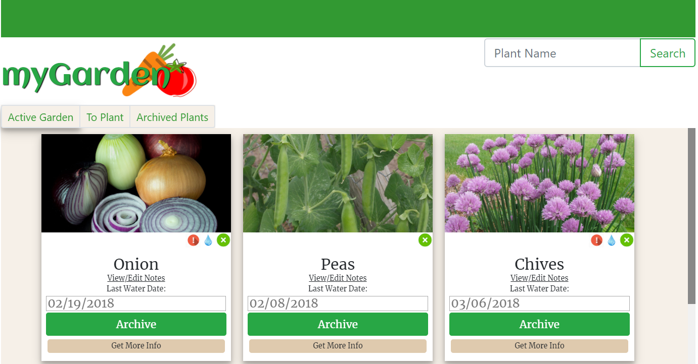
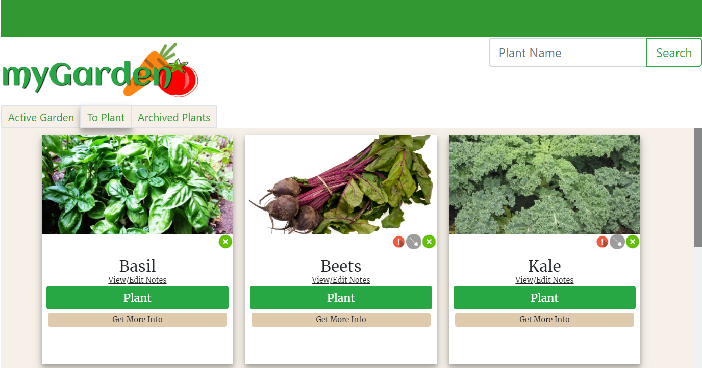
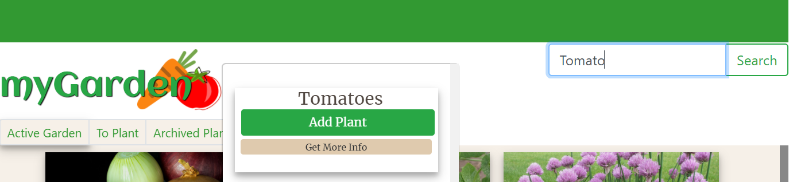
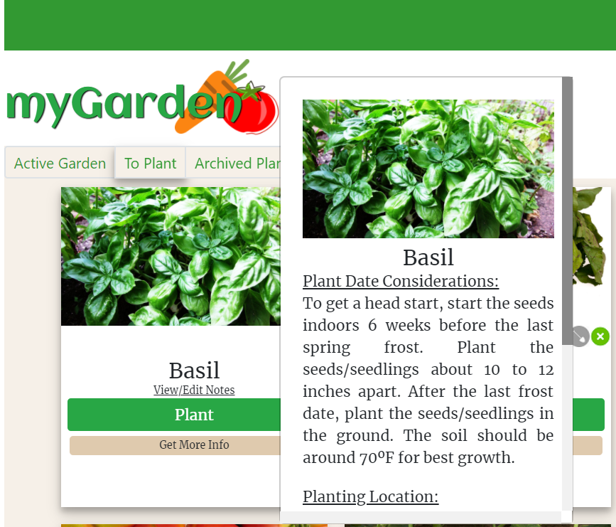
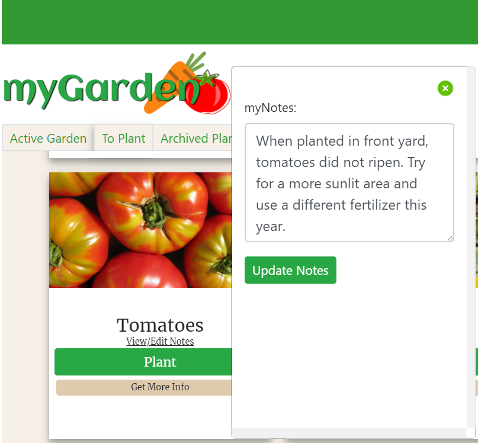

# myGarden

myGarden is a Web Application created to give a user a virtual representation of their physical garden. myGarden consolidates helpful planting and harvesting information to one location. In addition to providing information, myGarden automates alerts for both planting times and watering frequencies by using manually logged water dates as well as rain data from Weaher Underground. *plant season and weather is currently limited to Nashville, TN*

https://mygarden-f2283.firebaseapp.com 

## Data/API's used

****harvest_helper:**** myGarden uses the harvest_helper API (https://github.com/damwhit/harvest_helper) to provide specific planting requirements per each plant. 

****Weather Underground:**** Weather Underground was used to evaluate historical precipitation data to determine the last day of rain.

****Customized Data:**** I utilized harvest_helper data as well as a planting calendar on almanac.com (https://www.almanac.com/gardening/planting-dates/TN) to put together an additional data set in firebase to quantify watering frequencies and planting dates for user alert purposes.

****User Specific Data:**** Each plant a user adds is held historically in Firebase with additional user specific properties such as notes, last logged water date, last plant date, etc. Regardless of when/where a user is logged in to myGarden, they will be able to reference only their plants and notes from season's present, past, and future. 

## Requirements to run this app on your machine:

1. Fork and clone the repo onto your machine
2. Run `npm install` in your terminal to download all the required dependencies.
3. API Keys - these will be added as an object (format below) 
 + You will need to get an API key from harvest_helper to use any plant search/add functionality. --Documentation for requesting Harvest Helper API key can be found at http://harvesthelper.herokuapp.com/
 + You will need an API key for weatherUnderground as well. Documentation here: https://www.wunderground.com/weather/api/d/docs 

API Key Format:

app/config/api_keys.js

angular.module("myGardenApp").constant("API_Key", {

  harvestHelper: "YOUR KEY HERE",
  weather: "YOUR KEY HERE"

});

## Screenshots:

### Watering and Planting Alerts

### Harvest Helper API provides user planting requirements and details

### User stores their notes from season to season for future reference

## Technologies Used:
 + HTML/CSS
 + JavaScript
 + AngularJS w/ ui.router
 + Bootstrap
 + Firebase
 + Moment