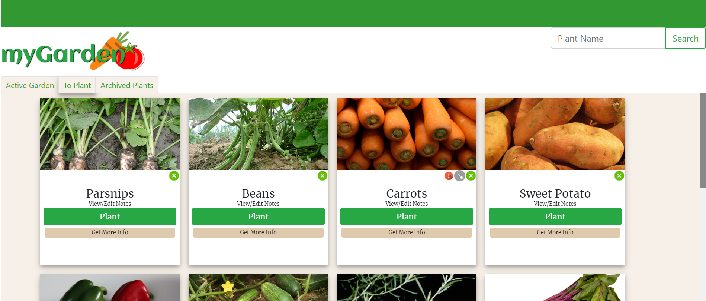
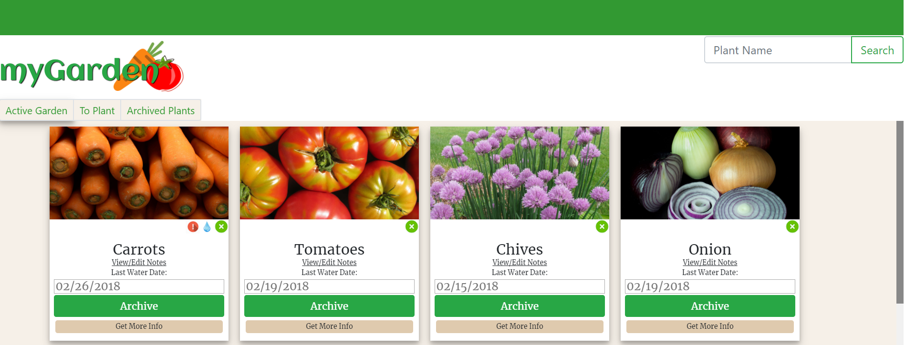

# myGarden

myGarden is a webApp created to give a user a virtual representation of their physical garden. myGarden consolidates helpful planting and harvesting information to one location. In addition to providing information, myGarden automates alerts for both planting times and watering frequencies by using manually logged water dates as well as rain data from Weaher Underground (API information below). *plant season and weather is currently limited to Nashville, TN*

myGarden uses the harvest_helper API (https://github.com/damwhit/harvest_helper) to provide specific planting requirements per each plant. I utilized harvest_helper data as well as a planting calendar on almanac.com (https://www.almanac.com/gardening/planting-dates/TN) to put together an additional data set to quantify watering frequencies and planting dates for user alert purposes.

myGarden also uses the Weather Underground historical data API to determine the last day with recorded precipitation.

## Requirements to run this app on your machine:

1. Fork and clone the repo onto your machine
2. `cd` into the `/lib` folder and run `npm install` to download all the required dependencies.
3. API Keys - these will be added as an object (format below) 
 + You will need to get an API key from harvest_helper to use any plant search/add functionality. --Documentation for requesting Harvest Helper API key can be found at http://harvesthelper.herokuapp.com/
 + You will need an API key for weatherUnderground as well. Documentation here: https://www.wunderground.com/weather/api/d/docs 

API Key Format:

app/config/api_keys.js

angular.module("myGardenApp").constant("API_Key", {

  harvestHelper: "YOUR KEY HERE",
  weather: "YOUR KEY HERE"

});

## Screenshots:

## Technologies Used:
 + AngularJS w/ ui.router
 + Bootstrap
 + Firebase
 + Moment